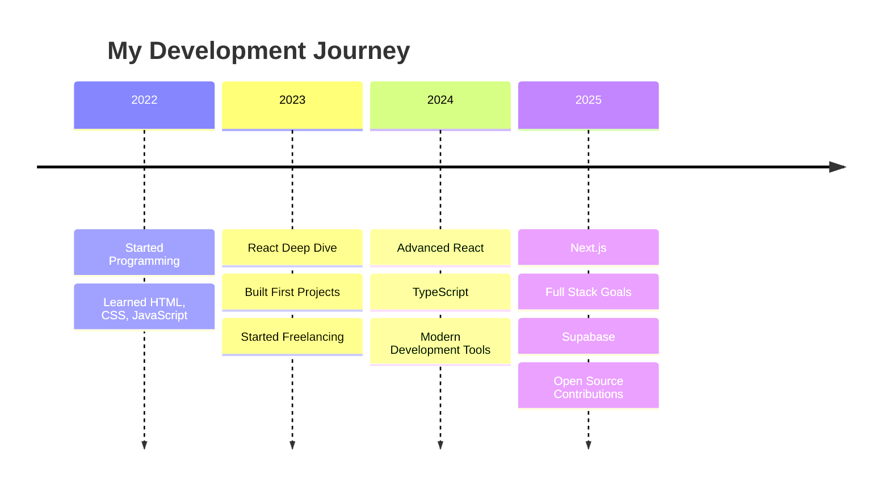

# 💫 Mohammed Fandees

<div align="center">
  
[](https://github.com/mohammed-fandees)
[](https://wakatime.com/@9b724250-5120-4677-a2e0-78b5979e78d1)

</div>

<div align="center">
  
</div>

<div align="center">
  
### 🌍 React Developer from Egypt | ⚡ Passionate about Modern Web Development

</div>

---

## 🚀 About Me


```typescript
const mohammed = {
    pronouns: "He" | "Him",
    location: "Egypt 🇪🇬",
    role: "React Developer",
    experience: "4+ Years",
    passion: ["Coding", "Learning", "Sharing Knowledge"],
    currentFocus: "Building awesome React applications",
    askMeAbout: ["React", "JavaScript", "Web Dev", "Problem Solving"],
    funFact: "I debug with console.log and I'm proud of it! 😄"
};
```

- 🔭 I'm currently working on **React Projects** and **Modern Web Applications**
- 🌱 I'm currently learning **Redux**, **Express.js**, and **MongoDB**
- 👯 I'm looking to collaborate on **Open Source Projects**
- 💬 Ask me about **React, JavaScript, Web Development**
- 📫 How to reach me: **mohammed.fandees@gmail.com**
- ⚡ Fun fact: **I love turning coffee into code! ☕➡️💻**

---

## 🛠️ Tech Stack

### 🎯 **Current Arsenal**

<div align="center">


</div>

### 🎯 **Next Learning Goals**

<div align="center">


</div>

---

## 📊 GitHub Analytics

<div align="center">
  
  
</div>

<div align="center">
  
</div>

---

## 🏆 Featured Projects

<div align="center">

<table>
<tr>
<td width="50%">

### 🌟 [My Portfolio](https://github.com/mohammed-fandees/my-portfolio)


**Personal portfolio showcasing my journey as a React Developer**
- 🚀 Built with React & Modern CSS
- 📱 Fully Responsive Design
- ⚡ Fast & Optimized Performance

</td>
<td width="50%">

### 💫 [Lonely](https://github.com/mohammed-fandees/lonely)


**Social platform connecting people meaningfully**
- 🤝 Real-time Chat Features
- 👥 Community Building Tools
- 🎨 Modern UI/UX Design

</td>
</tr>
<tr>
<td width="50%">

### 🧩 [Wedgets](https://github.com/mohammed-fandees/wedgets)


**Collection of useful web development widgets**
- 🔧 Reusable Components
- 📦 Easy Integration
- 🎯 Developer-Friendly

</td>
<td width="50%">

### 🛒 [Online Store](https://github.com/mohammed-fandees/online-store)


**Full-featured e-commerce platform**
- 🛍️ Complete Shopping Experience
- 💳 Secure Payment Integration
- 📊 Admin Dashboard

</td>
</tr>
</table>

</div>

<div align="center">
  
[](https://github.com/mohammed-fandees?tab=repositories)

</div>

---

## 🌐 Connect With Me

<div align="center">

[](https://mohammed-fandeess.firebaseapp.com)
[](https://linkedin.com/in/mohammed-fandees)
[](https://instagram.com/mohammed.fandees.cxo)
[](https://facebook.com/mohammed.fandees.cxo)
[](mailto:mohammed.fandees@gmail.com)

</div>

---

## 📈 Contribution Graph

<div align="center">
  


</div>

<div align="center">
  <picture>
  <source
    media="(prefers-color-scheme: dark)"
    srcset="https://raw.githubusercontent.com/platane/snk/output/github-contribution-grid-snake-dark.svg"
  />
  <source
    media="(prefers-color-scheme: light)"
    srcset="https://raw.githubusercontent.com/platane/snk/output/github-contribution-grid-snake.svg"
  />
  
</picture>

</div>

---

## 🏆 GitHub Trophies

<div align="center">
  


</div>

---

## 💼 Work Experience & Skills



---

## 📫 Let's Build Something Amazing Together!

<div align="center">

### 💡 "Code is like humor. When you have to explain it, it's bad." – Cory House


**💼 Open to freelance opportunities | 🤝 Always ready to collaborate | 🚀 Let's create something awesome!**


</div>
